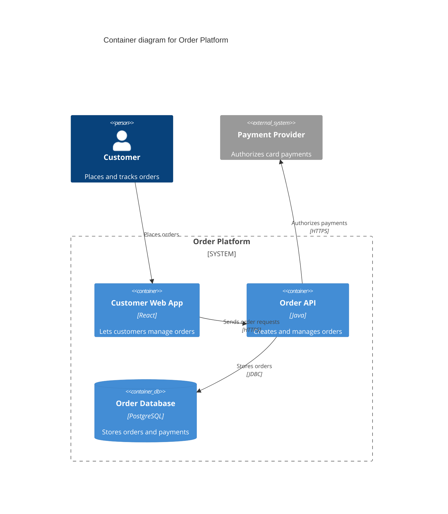
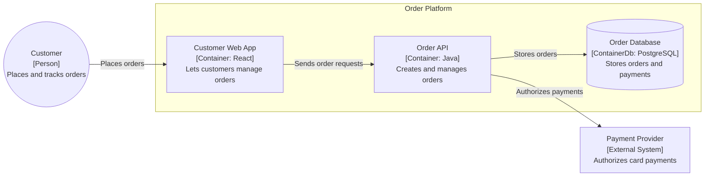

# C4 Mermaid

Create clear, single-level C4 diagrams in Mermaid. Prefer the smallest level that answers the request, then state assumptions only when needed.

## Workflow

1. Identify the system in focus, its users, and the relevant external systems.
2. Choose one C4 level for each diagram.
3. Model responsibilities and relationships before choosing technologies or layout details.
4. Use native Mermaid C4 syntax when the target renderer supports it; otherwise use the flowchart fallback.
5. Add boundaries only when they clarify ownership, trust, deployment, or architectural domains.
6. Review the diagram against the checklist before delivering it.

Ask only for information that prevents a useful diagram. Make reasonable assumptions explicit rather than blocking on minor gaps.

## Choose the C4 level

| Level | Use it to show | Include | Exclude |
| --- | --- | --- | --- |
| Context (`C4Context`) | The big picture | People, system in focus, external systems, high-level integrations | Technologies, internal containers, implementation details |
| Container (`C4Container`) | The main runtime or deployable parts of one system | Apps, APIs, workers, databases, queues, object stores, and their technologies | Internal module details |
| Component (`C4Component`) | The internals of one container | Controllers, services, repositories, adapters, schedulers, and modules | Other containers' internals |

Create a Code or UML class diagram only when the user explicitly requests class-, interface-, or function-level design.

## Model elements and relationships

- Use `Person` for a human role and `System` for the system in focus.
- Use `System_Ext` for external systems. Do not present a data store as an external actor merely because it is a dependency.
- Use `Container` for applications, APIs, workers, and services; use `ContainerDb` for databases, queues, and object stores at the container level.
- Use `Component` for a responsibility inside a selected container.
- Give elements concrete, functional names. Avoid vague names such as `Service`, `API`, or `DB` without a purpose.
- In Context diagrams, omit technologies. In Container diagrams, include a technology when it improves understanding. In Component diagrams, emphasize responsibility over implementation detail.
- Make each relationship directional and label it with a concise verb plus object, such as `Reads orders`, `Publishes events`, or `Authenticates users`.
- Avoid labels such as `Data`, `Flow`, `Communication`, or `Integration` because they do not explain the relationship.

## Native Mermaid C4 output

Wrap native C4 diagrams in a Mermaid fenced block. Use stable identifiers and readable labels.

Keep Context, Container, and Component concerns separate. Prefer one diagram per abstraction level rather than combining them.

## Flowchart fallback

When native Mermaid C4 syntax is unavailable, preserve the same semantics in a `flowchart`:

- Use rectangles for systems, applications, services, and components.
- Use cylinders for databases, queues, object stores, and other storage.
- Use circles for people or consuming actors.
- Use `subgraph` for system, trust, ownership, or domain boundaries.
- Use solid, labelled arrows for communication, actions, and read/write operations.

Use line breaks in fallback labels to make the name, C4 type, technology when relevant, and responsibility easy to scan. Use a dashed boundary only when the target style supports it and the boundary needs emphasis.

## Review checklist

Check the following before presenting or approving a diagram:

- Make the system in focus explicit.
- Match the C4 level to the question and avoid mixing levels.
- Distinguish people, systems, containers, components, and storage correctly.
- Mark external systems as external.
- Give every relationship direction and purpose.
- Use boundaries only where ownership, trust, deployment, or a domain distinction matters.
- Show sensitive services through their intended access path instead of implying direct access.
- Keep Context diagrams technology-free and implementation-light.
- Prefer labels that describe responsibilities, not only technologies.

## Response style

For a new diagram, state the selected C4 level, provide the Mermaid block, and list only material assumptions or gaps. For a review, lead with findings ordered by severity and give a specific correction for each finding.
