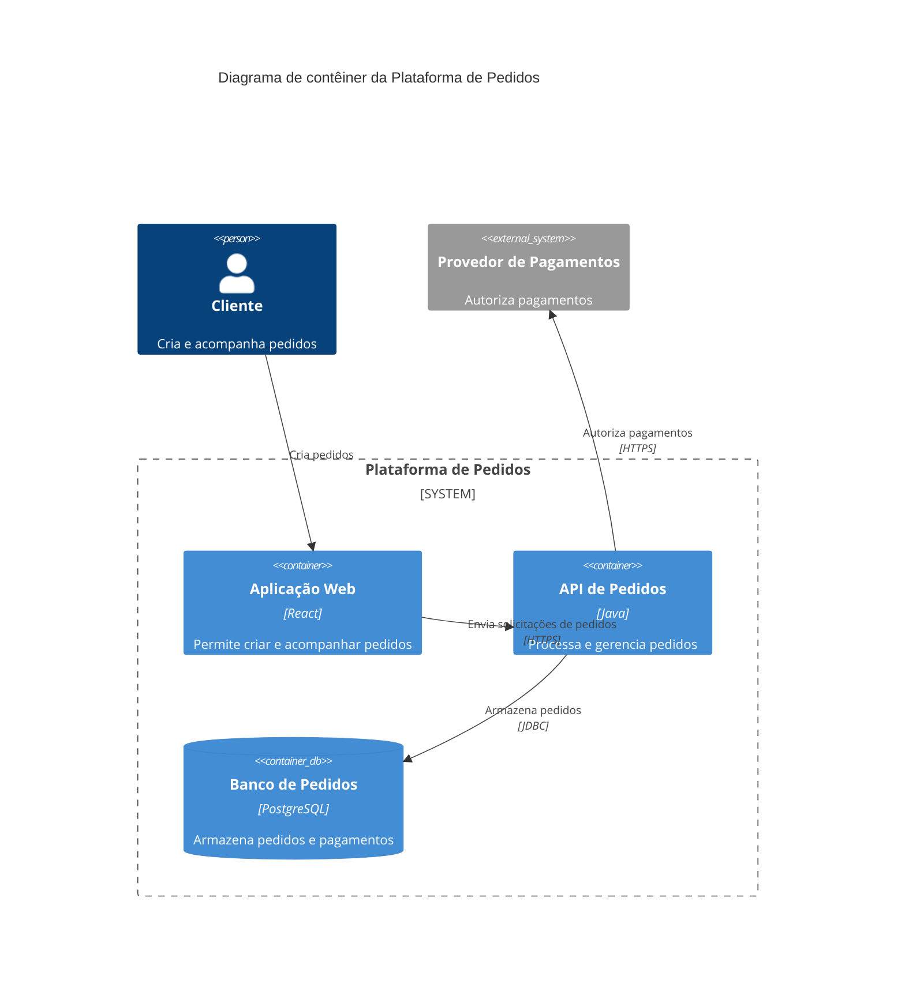

# Skill C4 Model

A skill **C4 Model** cria, atualiza e revisa diagramas de arquitetura baseados no modelo C4, usando Mermaid como formato de saída. Ela ajuda a transformar descrições de sistemas em diagramas claros, consistentes e adequados ao nível de abstração solicitado.

O objetivo da skill não é apenas desenhar caixas e setas. Ela identifica o sistema em foco, classifica corretamente pessoas, sistemas externos, contêineres, componentes e armazenamentos, além de verificar se cada relacionamento possui direção e propósito claros.

## Sumário

- [O que a skill faz](#o-que-a-skill-faz)
- [Quando usar](#quando-usar)
- [Níveis C4 suportados](#níveis-c4-suportados)
- [Como usar](#como-usar)
- [Como a skill constrói um diagrama](#como-a-skill-constrói-um-diagrama)
- [Elementos e relacionamentos](#elementos-e-relacionamentos)
- [Formatos de saída](#formatos-de-saída)
- [Exemplo completo](#exemplo-completo)
- [Revisão de diagramas existentes](#revisão-de-diagramas-existentes)
- [Boas práticas](#boas-práticas)
- [Limitações](#limitações)

## O que a skill faz

A skill pode ser utilizada para:

- criar diagramas C4 a partir de uma descrição textual da arquitetura;
- escolher o nível C4 mais adequado ao objetivo da documentação;
- representar pessoas, sistemas, aplicações, APIs, workers, bancos de dados, filas, object stores e integrações;
- separar corretamente elementos internos e externos ao sistema em foco;
- representar limites de sistema, confiança, implantação, propriedade ou domínio quando eles forem relevantes;
- atualizar um diagrama após mudanças na arquitetura;
- revisar diagramas existentes e apontar inconsistências de escopo, abstração, nomenclatura ou relacionamento;
- gerar Mermaid C4 nativo ou um `flowchart` equivalente quando o renderizador não suportar a sintaxe C4.

## Quando usar

Use a skill quando precisar documentar ou discutir a arquitetura de um software em um destes cenários:

- apresentar a visão geral de um sistema e suas integrações;
- mostrar os principais executáveis, serviços e armazenamentos de uma solução;
- detalhar os componentes internos de uma aplicação ou serviço;
- registrar uma arquitetura em documentação versionada;
- avaliar se um diagrama C4 existente está no nível correto;
- converter uma descrição informal de arquitetura em Mermaid;
- adaptar um diagrama C4 para um ambiente que aceite apenas `flowchart` do Mermaid.

A skill não é indicada para diagramas de classes, interfaces, funções ou outros detalhes de código. Para esse nível, solicite explicitamente um diagrama de código ou UML.

## Níveis C4 suportados

A skill trabalha com um nível de abstração por diagrama. Essa separação evita misturar visão de negócio, unidades de implantação e detalhes internos na mesma representação.

| Nível | Diretiva Mermaid | Pergunta respondida | Elementos principais | O que deve ficar de fora |
| --- | --- | --- | --- | --- |
| Contexto | `C4Context` | Quem usa o sistema e com quais sistemas ele se integra? | Pessoas, sistema em foco, sistemas externos e integrações principais | Tecnologias, contêineres e detalhes internos |
| Contêiner | `C4Container` | Quais aplicações e armazenamentos formam o sistema? | Aplicações, APIs, serviços, workers, bancos, filas e tecnologias relevantes | Módulos e classes internos |
| Componente | `C4Component` | Como um contêiner específico é organizado internamente? | Controllers, serviços, repositórios, adapters, schedulers e módulos | Detalhes internos de outros contêineres |

### Contexto

Use o diagrama de contexto para explicar a arquitetura a pessoas técnicas e não técnicas. Ele mostra o sistema como uma única unidade, seus usuários e dependências externas. Tecnologias e detalhes de implementação são omitidos para preservar a visão geral.

### Contêiner

Use o diagrama de contêiner para mostrar as principais partes executáveis ou implantáveis do sistema. Nesse nível, “contêiner” não significa necessariamente Docker: pode ser uma aplicação web, API, serviço, worker, banco de dados ou fila. Tecnologias podem ser informadas quando ajudam a compreender a solução.

### Componente

Use o diagrama de componente para detalhar as responsabilidades internas de um único contêiner. O foco fica em módulos relevantes e em como eles colaboram. A skill evita abrir simultaneamente os detalhes internos de vários contêineres.

## Como usar

Ative a skill pelo nome e descreva o resultado desejado:

```text
Use $c4-model para criar um diagrama de contexto de uma plataforma de e-commerce.
```

Para obter um resultado mais preciso, informe sempre que possível:

1. o sistema em foco;
2. o nível desejado ou o público do diagrama;
3. os usuários ou papéis que interagem com o sistema;
4. os sistemas externos relevantes;
5. os principais elementos internos, caso seja um diagrama de contêiner ou componente;
6. as relações entre os elementos e, quando relevante, os protocolos utilizados;
7. se o ambiente de destino suporta a sintaxe Mermaid C4 nativa.

Se informações secundárias estiverem ausentes, a skill pode fazer suposições razoáveis e apresentá-las junto ao resultado. Ela deve pedir esclarecimentos apenas quando a ausência de uma informação impedir a criação de um diagrama útil.

### Exemplos de solicitação

Criar um diagrama de contexto:

```text
Use $c4-model para criar um diagrama de contexto do Sistema de Pedidos.
Clientes fazem pedidos, operadores acompanham exceções e o sistema integra-se
ao provedor de pagamentos e ao serviço de entrega.
```

Criar um diagrama de contêiner:

```text
Use $c4-model para criar um diagrama de contêiner da Plataforma de Pedidos.
Ela possui uma aplicação web React, uma API Java, um worker de faturamento,
PostgreSQL e RabbitMQ. Inclua as tecnologias e os protocolos relevantes.
```

Criar um diagrama de componente:

```text
Use $c4-model para detalhar os componentes internos da API de Pedidos.
Considere controllers HTTP, serviço de pedidos, gateway de pagamentos e
repositório de pedidos. Não detalhe os outros contêineres.
```

Revisar um diagrama:

```text
Use $c4-model para revisar o diagrama Mermaid abaixo. Verifique o nível C4,
a classificação dos elementos, os limites e a direção dos relacionamentos.
[cole o diagrama aqui]
```

Solicitar o fallback:

```text
Use $c4-model para criar um diagrama de contêiner em Mermaid flowchart,
pois o renderizador de destino não suporta C4 nativo.
```

## Como a skill constrói um diagrama

O fluxo seguido pela skill é:

1. identificar o sistema em foco, seus usuários e os sistemas externos relevantes;
2. selecionar um único nível C4 para o diagrama;
3. modelar responsabilidades antes de decidir tecnologias ou detalhes visuais;
4. definir relacionamentos direcionais e descrever o propósito de cada interação;
5. adicionar limites somente quando eles esclarecem propriedade, confiança, implantação ou domínio;
6. gerar o diagrama em Mermaid C4 nativo ou em `flowchart`;
7. revisar o resultado para detectar mistura de níveis, elementos mal classificados e relações vagas.

Por padrão, a skill prefere o menor nível de detalhe capaz de responder à solicitação. Se forem necessários vários níveis, o resultado deve conter diagramas separados em vez de uma única representação misturada.

## Elementos e relacionamentos

### Elementos

| Elemento | Uso |
| --- | --- |
| `Person` | Representar uma pessoa, papel humano ou grupo de usuários |
| `System` | Representar o sistema em foco em um diagrama de contexto |
| `System_Ext` | Representar um sistema externo ao escopo ou à propriedade do sistema em foco |
| `Container` | Representar aplicações, APIs, workers e serviços |
| `ContainerDb` | Representar bancos de dados, filas, object stores e outros armazenamentos |
| `Component` | Representar uma responsabilidade ou módulo interno do contêiner selecionado |

Os elementos recebem nomes funcionais e específicos. Nomes genéricos como “Serviço”, “API” ou “Banco” devem ser substituídos por nomes que indiquem claramente sua responsabilidade, como “API de Pedidos” ou “Banco de Catálogo”.

### Relacionamentos

Cada relacionamento deve:

- possuir uma direção definida;
- usar um verbo e um objeto que expliquem a interação;
- informar o protocolo ou mecanismo somente quando isso melhorar a compreensão;
- evitar descrições vagas como “Dados”, “Fluxo”, “Comunicação” ou “Integração”.

Exemplos de rótulos adequados:

- `Cria pedidos`;
- `Consulta o catálogo`;
- `Publica eventos de pagamento`;
- `Autentica usuários`;
- `Armazena pedidos`.

## Formatos de saída

### Mermaid C4 nativo

É o formato preferencial quando o ambiente de destino suporta as diretivas `C4Context`, `C4Container` e `C4Component`. Ele preserva a semântica dos elementos do modelo C4 e torna o diagrama mais explícito.

### Flowchart Mermaid

Quando a sintaxe C4 nativa não estiver disponível, a skill produz um `flowchart` que mantém as mesmas ideias:

- círculos para pessoas ou atores consumidores;
- retângulos para sistemas, aplicações, serviços e componentes;
- cilindros para bancos, filas e outros armazenamentos;
- `subgraph` para limites de sistema, domínio, confiança ou propriedade;
- setas sólidas e rotuladas para ações e comunicação.

O fallback prioriza equivalência semântica, mas não transforma o `flowchart` em uma implementação oficial da notação C4.

## Exemplo completo

Solicitação:

```text
Use $c4-model para criar um diagrama de contêiner da Plataforma de Pedidos.
O cliente usa uma aplicação web. A aplicação chama uma API, que autoriza pagamentos
em um provedor externo e armazena pedidos em PostgreSQL.
```

Saída esperada:



Além do bloco Mermaid, a skill pode informar o nível selecionado e listar apenas suposições ou lacunas que tenham impacto material no entendimento do diagrama.

## Revisão de diagramas existentes

Ao revisar um diagrama, a skill apresenta primeiro os problemas mais importantes e propõe uma correção específica para cada um. A análise verifica se:

- o sistema em foco está explícito;
- o diagrama usa um único nível C4;
- pessoas, sistemas, contêineres, componentes e armazenamentos estão classificados corretamente;
- sistemas externos estão identificados como externos;
- todos os relacionamentos possuem direção e propósito;
- limites representam distinções arquiteturais reais;
- serviços sensíveis são acessados pelos caminhos pretendidos;
- diagramas de contexto permanecem livres de tecnologias e detalhes internos;
- nomes descrevem responsabilidades em vez de apenas tecnologias.

Depois da análise, você pode pedir a versão corrigida:

```text
Use $c4-model para aplicar as correções propostas e devolver o diagrama revisado.
```

## Boas práticas

- Declare claramente o sistema em foco.
- Escolha o nível com base na pergunta que o diagrama precisa responder.
- Crie diagramas separados quando precisar apresentar mais de um nível.
- Mantenha descrições curtas, funcionais e compreensíveis sem depender do código-fonte.
- Use tecnologias principalmente no nível de contêiner e apenas quando forem relevantes.
- Evite adicionar limites apenas por motivos estéticos.
- Não represente um armazenamento como ator externo somente porque ele é uma dependência.
- Não sugira acesso direto a bancos ou serviços sensíveis quando a arquitetura exige uma API ou outro caminho controlado.
- Confirme o suporte do renderizador à sintaxe C4 nativa antes de publicar o diagrama.

## Limitações

- A qualidade do resultado depende da clareza e da completude da descrição fornecida.
- A skill documenta a arquitetura informada; ela não descobre automaticamente componentes ou integrações que não estejam disponíveis no contexto.
- O suporte à sintaxe Mermaid C4 varia entre renderizadores e versões. Quando necessário, use o fallback em `flowchart`.
- O nível de código do modelo C4 não é gerado por padrão. Diagramas de classes, interfaces ou funções devem ser solicitados explicitamente e podem exigir outra notação.
- Diagramas muito extensos perdem legibilidade. Nesses casos, divida a arquitetura por nível, sistema, domínio ou fluxo relevante.

As instruções operacionais que definem o comportamento da skill estão em [`SKILL.md`](./SKILL.md).
