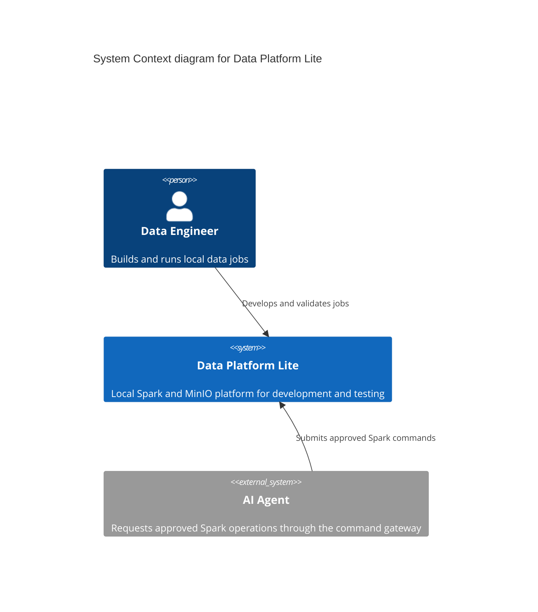
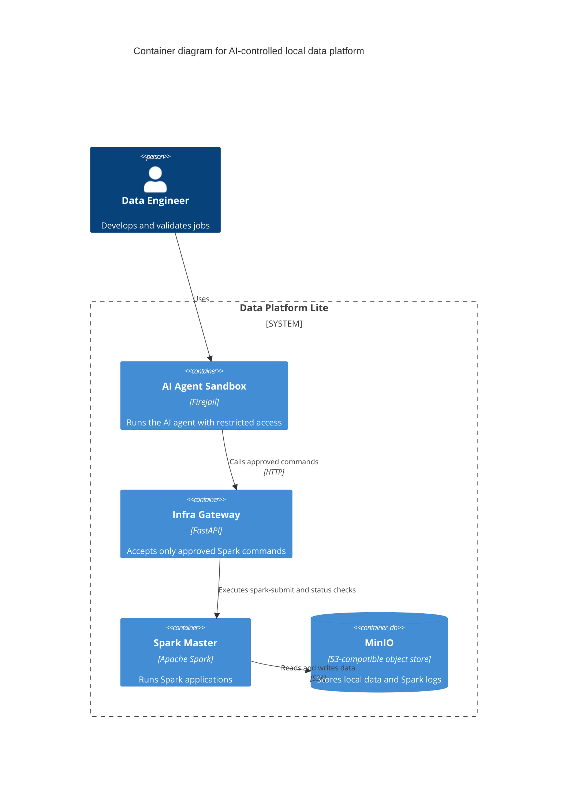
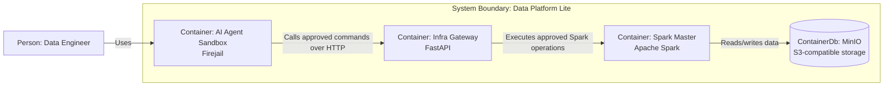

# C4 Model Mermaid

Use this skill to create, review, or update C4 Model architecture diagrams with Mermaid as the default output format.

## When To Use

Use this skill when the user asks for C4, architecture diagrams, system context, container diagrams, component diagrams, Mermaid architecture docs, system boundaries, integrations, users, external systems, or relationship mapping.

Do not use this skill for generic flowcharts unless the user explicitly wants a C4-style architecture view or Mermaid fallback.

## Default Output

Default to Mermaid fenced blocks in Markdown:

````markdown
```mermaid
C4Context
...
```
````

Prefer Mermaid C4 syntax when the target renderer supports it:

- `C4Context` for system context.
- `C4Container` for containers and major runtime/deployable units.
- `C4Component` for internals of one container.

If Mermaid C4 is not supported by the target renderer, use a `flowchart` fallback with C4 naming conventions.

## Workflow

1. Identify the system in focus.
2. Choose the smallest C4 level that answers the user's question.
3. Ask only for missing information that blocks a useful diagram.
4. Keep one C4 abstraction level per diagram.
5. Label relationships with clear verbs or short phrases.
6. Add a short explanation or assumptions list when helpful.
7. Include boundaries for teams, trust zones, platforms, or deployment contexts when relevant.

## Level Selection

Use `C4Context` when the user wants the big picture:

- users/personas
- system in focus
- external systems
- high-level integrations

Use `C4Container` when the user wants the system's main parts:

- applications
- APIs
- workers
- databases
- queues
- object stores
- command gateways

Use `C4Component` when the user wants details inside one container:

- modules
- services
- controllers
- repositories
- adapters
- schedulers

Use Code-level diagrams only when the user explicitly asks for class/function-level design. C4 Code diagrams are usually too detailed for architecture documentation.

## Mermaid Guidelines

Prefer stable identifiers and readable labels:



Use boundaries when they clarify ownership or trust:



Avoid:

- mixing Context, Container, and Component concerns in one diagram
- unnamed relationships
- implementation details in Context diagrams
- databases represented as external actors
- ambiguous names like `service`, `api`, or `db` without context

## Fallback Flowchart

If Mermaid C4 is unavailable, use `flowchart` while preserving C4 semantics:



## Review Checklist

Check C4 diagrams for these issues:

- The system in focus is explicit.
- The selected C4 level matches the user's question.
- Actors, systems, containers, and components are not mixed incorrectly.
- Every relationship has direction and purpose.
- External systems are marked as external.
- Databases, queues, and object stores are modeled at the container level.
- Trust boundaries and sensitive-data boundaries are visible when relevant.
- Security-sensitive services are not shown as directly accessible if access is mediated.
- Diagram labels describe responsibilities, not only technologies.

## Response Style

When producing a diagram, keep the response concise:

1. State the selected C4 level.
2. Provide the Mermaid diagram.
3. List important assumptions or gaps only if needed.

When reviewing a diagram, lead with findings ordered by severity and include specific fixes.
